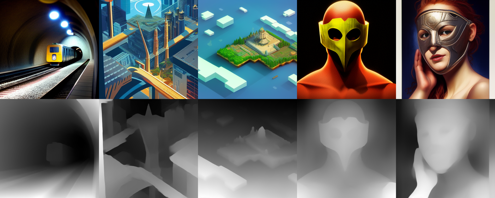

# Depth Maps for Stable Diffusion
This script is an addon for [AUTOMATIC1111's Stable Diffusion Web UI](https://github.com/AUTOMATIC1111/stable-diffusion-webui) that creates `depthmaps` from the generated images. The result can be viewed on 3D or holographic devices like VR headsets or [loogingglass](https://lookingglassfactory.com/) display, used in Render- or Game- Engines on a plane with a displacement modifier, and maybe even 3D printed.

To generate realistic depth maps from a single image, this script uses code and models from the [MiDaS](https://github.com/isl-org/MiDaS) repository by Intel ISL. See [https://pytorch.org/hub/intelisl_midas_v2/](https://pytorch.org/hub/intelisl_midas_v2/) for more info.

## Examples


## Updates
* v0.1.4 update
    * implemented `--no-half` and precision scope. Now also works with cards that don't support half precision like GTX 16xx. ([verified](https://github.com/thygate/stable-diffusion-webui-depthmap-script/issues/12))
* v0.1.3 bugfix
    * bugfix where some controls where not visible (see [issue](https://github.com/thygate/stable-diffusion-webui-depthmap-script/issues/11))
* v0.1.2 new option
    * network size slider. higher resolution depth maps (see usage below)
* v0.1.1 bugfixes
    * overflow issue (see [here](https://github.com/thygate/stable-diffusion-webui-depthmap-script/issues/10) for details and examples of artifacts)
    * when not combining, depthmap is now saved as single channel 16 bit

> 💡 To update, only replace the `depthmap.py` script, and restart.

## Install instructions
* Save `depthmap.py` into the `stable-diffusion-webui/scripts` folder.
* Clone the [MiDaS](https://github.com/isl-org/MiDaS) repository into `stable-diffusion-webui/repositories/midas` by running this command from the stable-diffusion-webui directory :
    * `git clone https://github.com/isl-org/MiDaS.git  repositories/midas`
* Restart AUTOMATIC1111

>Model `weights` will be downloaded automatically on first use and saved to /models/midas.

## Usage
Select the "DepthMap vX.X.X" script from the script selection box in either txt2img or img2img.


There are four models available from the `Model` dropdown : dpt_large, dpt_hybrid, midas_v21_small, and midas_v21. See the [MiDaS](https://github.com/isl-org/MiDaS) repository for more info. The dpt_hybrid model yields good results in our experience, and is much smaller than the dpt_large model, which means shorter loading times when the model is reloaded on every run.

The model was designed to work with 384x384 input images, using a larger size results in more detail in most cases. Best results with dpt_large. Setting it too high might give worse results. This is an option since v0.1.2 You can set it using the `Net size` slider. Default value is 384. 

The model can `Compute on` GPU and CPU, default is GPU with fallback to CPU.

Regardless of global settings, `Save DepthMap` will always save the depthmap in the default txt2img or img2img directory with the filename suffix '_depth'. Generation parameters are always included in the PNG.

To see the generated output in the webui `Show DepthMap` should be enabled.

When `Combine into one image` is enabled, the depthmap will be combined with the original image, the orientation can be selected with `Combine axis`. When disabled, the depthmap will be saved as a 16 bit single channel PNG as opposed to a three channel (RGB), 8 bit per channel image when the option is enabled.


## Citation

This project uses code and information from following papers, from the repository [github.com/isl-org/MiDaS](https://github.com/isl-org/MiDaS) :
```
@ARTICLE {Ranftl2022,
    author  = "Ren\'{e} Ranftl and Katrin Lasinger and David Hafner and Konrad Schindler and Vladlen Koltun",
    title   = "Towards Robust Monocular Depth Estimation: Mixing Datasets for Zero-Shot Cross-Dataset Transfer",
    journal = "IEEE Transactions on Pattern Analysis and Machine Intelligence",
    year    = "2022",
    volume  = "44",
    number  = "3"
}
```

Dense Prediction Transformers, DPT-based model :

```
@article{Ranftl2021,
	author    = {Ren\'{e} Ranftl and Alexey Bochkovskiy and Vladlen Koltun},
	title     = {Vision Transformers for Dense Prediction},
	journal   = {ICCV},
	year      = {2021},
}
```